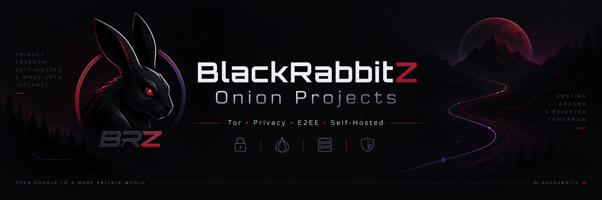

# 🧅 Onion Projects

Eine zentrale Übersicht meiner Projekte rund um **Tor, Onion Services, private Kommunikation und datenschutzorientierte Infrastruktur**.

Der Schwerpunkt liegt auf selbst kontrollierten Lösungen, verschlüsselter Kommunikation und Diensten, die über das **Tor-Netzwerk** erreichbar sind.

---

## 📦 Projekte

| Projekt | Beschreibung | Schwerpunkt |
|---|---|---|
| [OnionCall](https://github.com/BlackRabbitZ/OnionCall) | Private Text- und Sprachkommunikation über Tor Onion Services | Tor • Onion Services • E2EE • Privacy |
| [OnionVPN](https://github.com/BlackRabbitZ/BRZ-OnionVPN) | Cross-platform Tor-VPN für Windows, Linux und macOS mit TUN-Routing, Onion-Servermodus und systemweitem Traffic-Tunneling | Tor • Onion Services • E2EE • Privacy |

---

**BlackRabbitZ**

*Privacy • Security • Self-Hosting • Tor*

[GitHub Profil](https://github.com/BlackRabbitZ)

